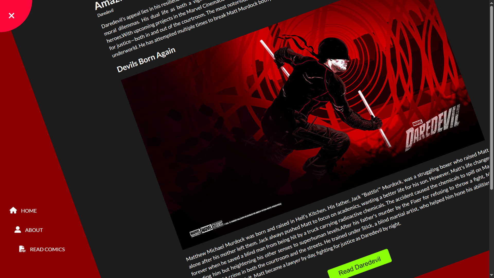

# Rotating Navigation Website with Comics Reader

## 📌 Overview
This project is a **Rotating Navigation Website** where users can navigate through an animated menu. Additionally, it includes a **Comics Reader** feature that allows users to open and read comics easily.

## 🚀 Features
- **Rotating Navigation:** A smooth and interactive rotating menu.
- **Comics Reader:** Users can open and read comics directly from the website.
- **Responsive Design:** Works on desktop and mobile devices.

## Demo:


## 🎮 How to Use
1. **Open Navigation:** Click the navigation button to open the rotating menu.
2. **Read Comics:** you can read comics by clicking button.
3. **Navigate Back:** Click 'Home' to return smoothly to the top of the page.


## 🏗️ Setup Instructions
**Clone the repository:**
   ```sh
   git clone https://github.com/Khairul2556/Rotating-Navigation.git
   ```


---
📢 **Suggestions & Improvements**
Feel free to contribute and improve this project! Fork the repository and submit a pull request. 😊

